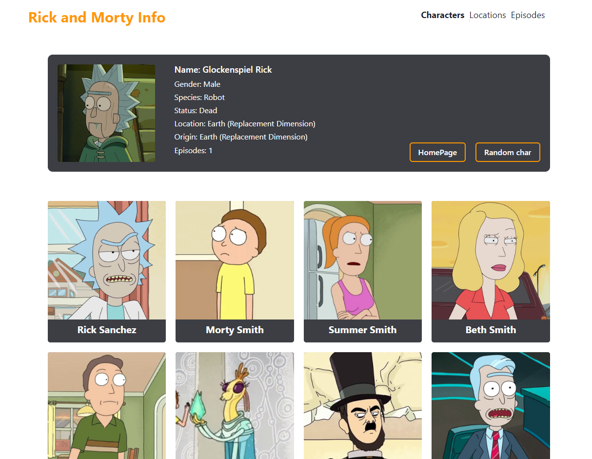

# Rick and Morty

**Вы также можете прочитать этот README на [русском](https://github.com/klekwedge/cv/blob/main/README.md)**

## Table of contents

- [Deployment instructions](#deployment-instructions)
- [Overview](#overview)
  - [Screenshot](#screenshot)
  - [Links](#links)
- [My process](#my-process)
  - [Built with](#built-with)
  - [What I learned](#what-i-learned)
- [Author](#author)

## Deployment instructions

**To run the project, you need to have [npm](https://nodejs.org/en/) and [git](https://git-scm.com/downloads) installed on your computer**

1. Make a clone of this repository ```git clone https://github.com/klekwedge/todo.git```
2. Install all required npm packages with ```npm i```
3. Run the project with the command ```npm run dev```

## Overview

### Screenshot



### Links

- [Solution URL](https://github.com/klekwedge/rick-and-morty)
- [Live Site URL](https://klekwedge-rick-and-morty.vercel.app/)

## My process

### Built with

- React
- Next
- TypeScript
- Chakra UI
- SCSS


### What I learned

I learned how to send requests to the API, receive a response from the server and process it, display the received data on the pages. I made a multi-page application (SPA), I understood how the Next works, in particular, the server side rendering and routing. I learned how to better type the received data using TypeScript, work with services.

## Author

- [Website](https://klekwedge-cv.vercel.app/)
- [Linkedin](https://www.linkedin.com/in/klekwedge/)
- [Facebook](https://www.facebook.com/klekwedge)
